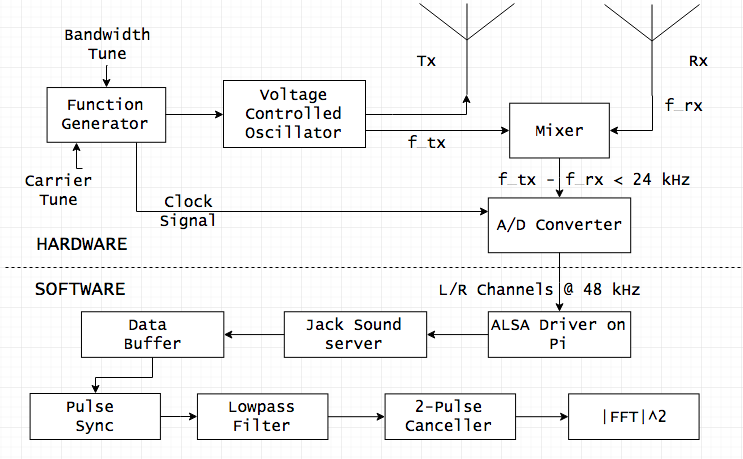

## Software-Defined Radar using Raspberry Pi and Coffee Cans
#### Project for UW EE542 - Advanced Embedded Systems Design

### Overview
#### Git Basics
To clone this repository you must have a `git` client installed. This overview will assume you have installed [git for windows](https://git-scm.com/download/win) and have the `git` bash shell available. Although, the instructions will work in any UNIX-like shell environment.

-  Clone the repository by executing
`git clone https://github.com/p5a0u9l/ee542`

- This will download and place the files in a folder called `ee542`

- To add material to the repository simply move the file(s) to folder containing the repo.
- `git` will automatically see these new files.
- If, from the bash shell, inside the repo (possibly need a `cd ee542`), you enter `git status`, you will see something like

- The simplest way to push this new file to `github.com` is with
`git add -A && git commit -m "this is my message" && git push origin master`
- The output should look something like

#### Motivation
Dr. Gregory Charvat _et al_ developed and documented a simple, yet powerful [laptop radar system](http://ocw.mit.edu/resources/res-ll-003-build-a-small-radar-system-capable-of-sensing-range-doppler-and-synthetic-aperture-radar-imaging-january-iap-2011/projects/MITRES_LL_003IAP11_proj_in.pdf) that uses coffee cans as Receive/Transmit Antennas.

I have wanted to have an excuse for trying this out, pairing it with a Raspberry Pi, instead of a laptop, and giving it some battery power to deploy in front of my house and record all the speed-limit busters! Similar projects have been implemented and provided at least a little direction for me,

- [Doppler Radar Explanation and Demo using the coffee can radar](https://www.youtube.com/watch?v=FOWopYv-JTM&list=PL60EBFF0DDA0145CA)
- [Build a Speed Camera and Traffic Logger on durablescope.com](http://blog.durablescope.com/post/BuildASpeedCameraAndTrafficLogger/)

This documentation will attempt to serve as a guide for duplicating and possibly extending my own effort.

#### Abstract

Doppler radar is an older technology that is finding renewed interest with modern computing hardware and software advances. It is widely used in applications like weather forecasting, law enforcement, aerospace, and healthcare. The technology exploits the Doppler effect to remotely capture data about a moving object's velocity. Additionally, system-on-a-chip technology is continually making it easier to deploy complicated embedded systems. This project will leverage the Cantenna Radar project developed by Dr. Gregory Charvat at MIT interfaced via a sound card to a Raspberry Pi to develop and deploy a simple, real-time Doppler Radar. The system will be used to measure, log, and analyze the speed of vehicles on a residential street over time.

#### Design Requirements

##### Dwell Period

  - In signal processing there is often found a fundamental trade-off between resolution in the time domain vs. resolution in the frequency domain. Because our doppler radar utilizes a continuous-wave (CW) waveform, we have fewer constraints on our signal integration time than a pulsed radar would have. The shorter the dwell period is the more time resolution will be available, which is important for systems with rapidly changing environments. Similarly, the longer the dwell period,
    the more frequency resolution is available.
    Considering the use case of measuring the speed of moving vehicles, the upper bound on how long to integrate is based on how long we can anticipate the sensed environment remaining approximately stationary. This could easily be on the order of milliseconds, but is probably not on the order of seconds.
    - With a fuzzy upper bound on integration time, we might ask to what level of accuracy speed detection is desired. Most stand-alone doppler systems display speed to drivers in single digits. Therefore, a resolution of 1 mph is probably sufficient.
    - Choosing that value as the required accuracy, we can ask, how many Hz does 1 mph correspond with. This can be found from solving the below for $v\_{mph} = 1$

    f_{doppler} = \frac{2 v_{mph}}{K \lambda}

where $\lambda$ is the wave length in meters, and $K$ is a conversion factor to mph. We get ~7.7 Hz for 1 mph at 2.4 GHz carrier. Using the definition of frequnecy resolution,

\begin{align}
    \Delta f = 1/T
\end{align}

and solving for signal time $T$, we have ~130 ms of FFT integration will provide 1 mph resolution. This value is easily within our expectations for sensed environment stationarity.

#### Doppler Processing Playback

- Using the sample data from the [MIT opencourseware site](http://ocw.mit.edu/resources/res-ll-003-build-a-small-radar-system-capable-of-sensing-range-doppler-and-synthetic-aperture-radar-imaging-january-iap-2011/) I developed a visualization tool that demonstrates
real-time playback, peak-speed detection, and combines it with the sound file itself. I uploaded the video to youtube and it can be access by clicking the image below.

    * The upper subplot is a frequency view (transformed to speed in mph) of an average over 5 coherent integration periods, or "dwells". Each dwell is over 50 ms, and so the doppler spectrum being shown is over 250 ms, a 1/4 of a second. This seems a reasonable rate at which to track vehicle movement. Assuming, of course, the vehicle has negligible accelaration over this period.

    The red _*_ is the maximum value over the spectrum at that moment and is a reasonable estimate of the speed.

    * The lower subplot is an image of the same 250 ms period, but "seen from above". That is, the color/intensity values reflect the signal magnitude at that pixel. This image scrolls over time.

    

    * Also, the full doppler image is included as reference

#### Block Diagram

#### Schedule

see [Gantt Chart](report/gantt_chart.pdf)

#### Bill of Materials

see [Bill of Materials](report/bom.txt)

-   NOTE: Materials unique to this project are contained in the second table. For the first table, the more complete BOM in the above
link is recommended. However, it should be noted (as I found out) that the table was compiled in 2011 and some of the part
numbers are obsolete. Using the table description should hep find a suitable replacement.

#### Steps

1. Setting up Raspberry Pi 2
    - Installing OS onto SD chip
        o Chose to use Arch Linux ARM
        o Followed instructions at https://archlinuxarm.org/platforms/armv7/broadcom/raspberry-pi-2
        o Challenge - initially followed instructions for Raspberry Pi 1
        o ARM architectures have less software/driver support than x_86

